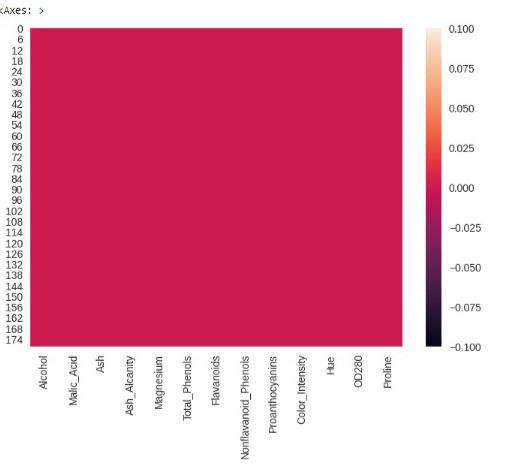
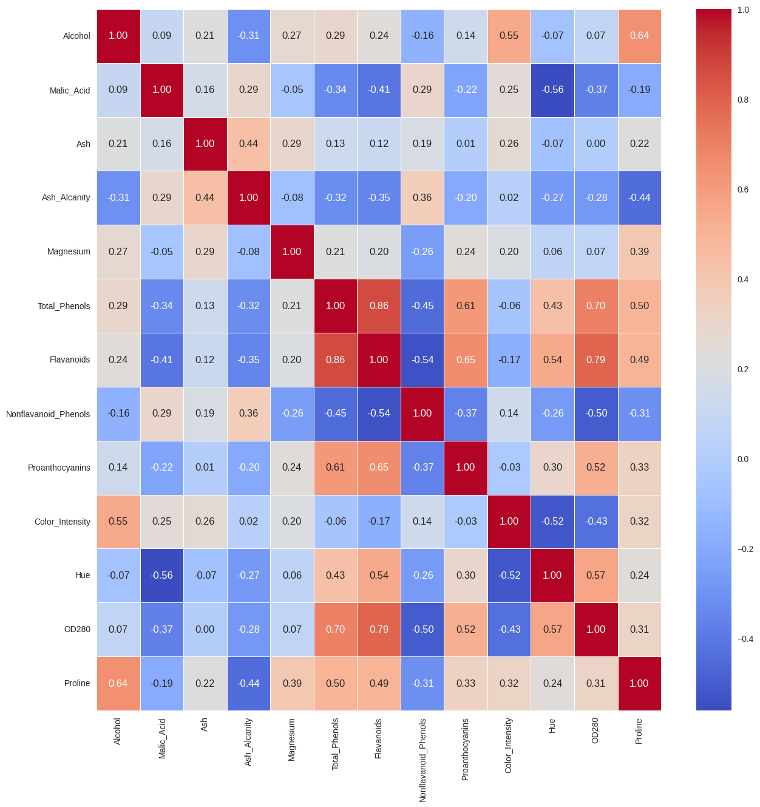
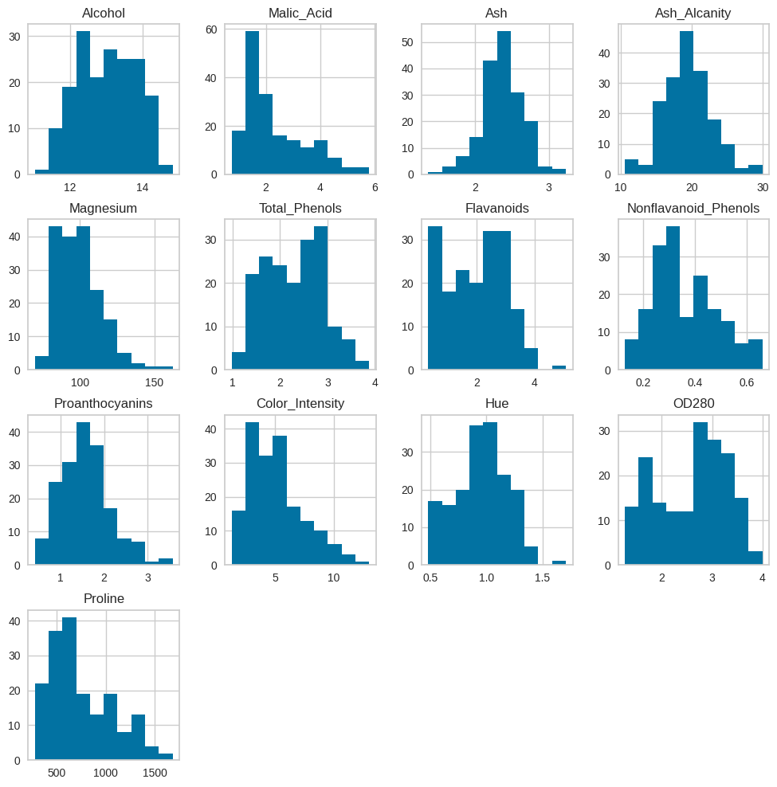
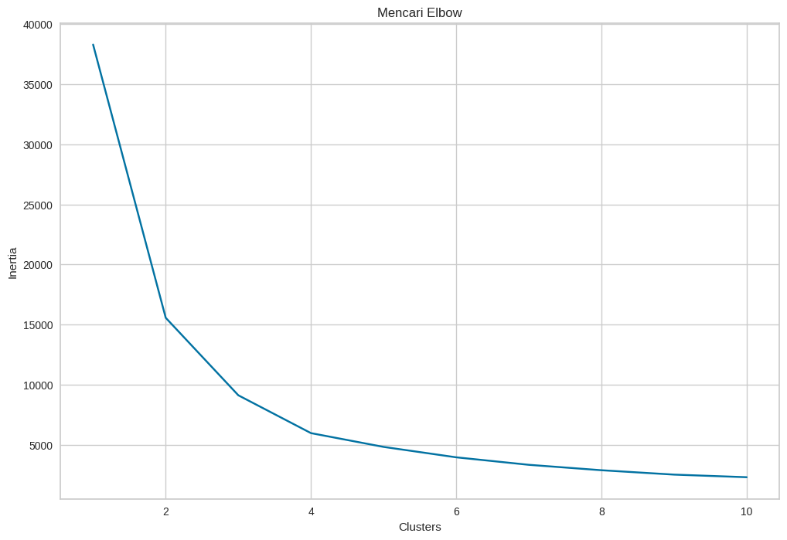
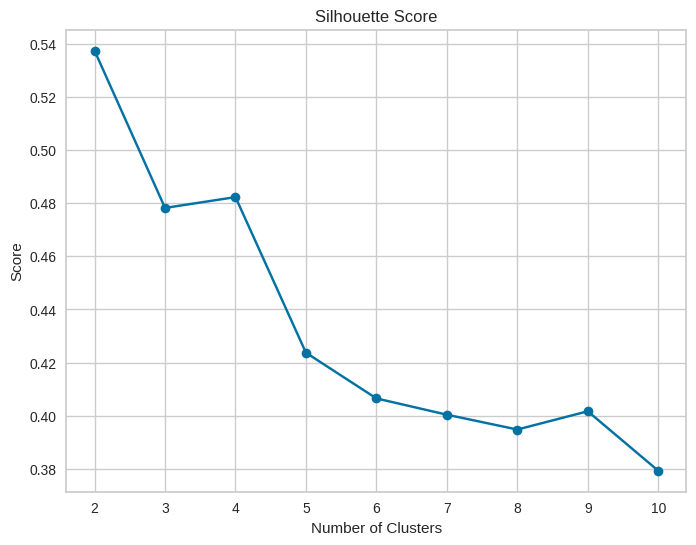
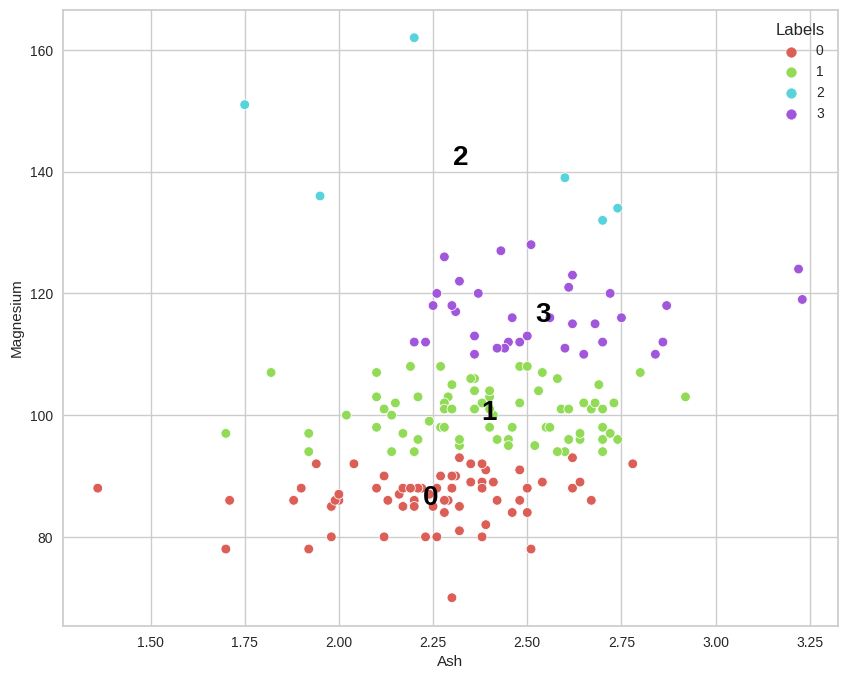

# Laporan Proyek Machine Learning
### Nama       : Debrina Azzahra
### Nim        : 211351155
### Kelas      : TIF Malam B
### Algorima   : K-Means

## Domain Proyek
  Anallisis jenis anggur yang ditanam di wilayah yang sama di Italia, namun berasal dari tiga jenis anggur  berbeda. Jenis anggur memiliki peran penting dalam menentukan karakteristik kimia dari anggur yang dihasilkan. Analisis kimiawi melibatkan identifikasi dan pengukuran 13 data utama yang dianggap signifikan dalam menentukan kualitas dan karakteristik anggur. data-data ini mencakup berbagai elemen seperti alkohol, asam malat, abu, alkalinitas abu, magnesium, jumlah fenol, flavanoid, fenol nonflavanoid, proanthocyanin, intensitas warna, warna, OD280/OD315 anggur encer, dan prolin.

  Format Referensi: [Wine Cluster](https://www.kaggle.com/datasets/harrywang/wine-dataset-for-clustering/data) 

  # BUSINESS UNDERSTANDING
  Dilakukan proses klasterisasi untuk mengidentifikasi pola-pola kemiripan atau perbedaan antara sampel-sampel anggur. Klasterisasi adalah teknik pengelompokan data yang sering digunakan dalam analisis data untuk mengelompokkan objek-objek yang serupa berdasarkan atribut-atribut tertentu.
  Penerapan klasterisasi pada data ini dapat membantu mengidentifikasi kelompok-kelompok anggur yang memiliki profil kimiawi serupa atau berbeda. Dengan mengelompokkan anggur berdasarkan kemiripan karakteristik kimianya, kita dapat memahami lebih baik bagaimana tiga kultivar tersebut berbeda satu sama lain dalam hal komposisi kimia anggurnya.

### Problem Statements
 Menganalisis cluster anggur berdasarkan kandungan kimianya. Mencakup berbagai elemen seperti alkohol, asam malat, abu, alkalinitas abu, magnesium, jumlah fenol, flavanoid, fenol nonflavanoid, proanthocyanin, intensitas warna, warna, OD280/OD315 anggur encer, dan prolin yang kemudian di bedakan berdasarkan kluster kluster yang ada.

### Goals
  Dataset yang di ambil dari kaggle bertujuan untuk menngelompokkan data anggur, berdasarkan kluster yang ada.
  
### Rubrik/Kriteria Tambahan (Opsional) :
**Solution statements** 
- Platform berbasis web maupun aplikasi yang memberikan informasi mengenai kluster-kluster dalam data anggur.
- Model yang dihasilkan dari datasets menggunakan algoritma k-Means.

## Data Understanding

Tahap ini, membuat ringkasaan (summary) dan mengidentifikasi potensi masalah m data. Tahap ini juga harus dilakukan secara cermat dan tidak terburu-buru, seperti pada visualisasi data, yang terkadang insight-nya sulit didapat dika dihubungkan dengan summary data nya. Jika ada masalah pada tahap ini yang belum terjawab, maka akan menggangu pada p modeling. Dataset yang saya gunakan berasal dari Kaggle yang didapat dari perkebunan anggun yang berada di Italia.

Dataset: [Wine Cluster](https://www.kaggle.com/datasets/harrywang/wine-dataset-for-clustering/data)

### Variabel-variabel pada Heart Failure Prediction Dataset adalah sebagai berikut:

- Alcohol                         ( Menentukan jumlah kandungan alkohol) (%)                  
- Malic acid                      ( Menetukan jumlah kandungan asam malat ) (g/L)
- Ash                             ( Menetukan jumlah kangdungan abu ) (g/L)
- Alcalinity of ash               ( Menetukan jumlah kandungan alkalinitas abu ) (meq/L) 
- Magnesium                       ( Menentukan jumlah kandungan magnesium ) (g/L)
- Total phenols                   ( Menentukan jumlah kandungan senyawa fenolik ) (g/L)
- Flavanoids                      ( Menentukan jumlah kandungan flavanoids ) (g/L)
- Nonflavanoid phenols            ( Menentukan Jumlah kandungan Nonflavanoid phenols ) (g/L)
- Proanthocyanins                 ( Menentukan jumlah kandungan Proanthocyanins ) (g/L)
- Color intensity                 ( Menentukan jumlah kandungan Intensitas Warna ) 
- Hue                             ( Menentukan jumlah kandungan jenis warna ) 
- OD280/OD315 of diluted wines    (Menentukan jumlah kandungan anggur yang diencerkan )
- Proline                         ( Menentukan jumlah kandungan proline ) (g/L)

## Data Preparation
**Data Collection** 
Untuk data collection ini, saya mendapatkan dataset yang nantinya digunakan dari website kaggle dengan nama dataset wine clustering.

## Library yang akan digunakan
**Data Discovery And Profiling** 

Import semua library yang dibutuhkan

    import pandas as pd
    import numpy as np
    import matplotlib.pyplot as plt
    import seaborn as sns
    import sklearn.cluster as cluster
    from sklearn.model_selection import train_test_split
    from sklearn.cluster import KMeans
    from sklearn.preprocessing import StandardScaler
    from sklearn.metrics import silhouette_score
    from yellowbrick.cluster import KElbowVisualizer
    from sklearn.decomposition import PCA

 ## Deskripsi Dataset
Karena kita memakai googgle collab bukan csv maka kita Import file 

    from google.colab import files

Upload token kaggle agar nanti bisa mendownload sebuah dataset dari kaggle melalui google colab

    file.upload()

Setelah mengupload filenya, selanjutnya membuat folder untuk menyimpan file kaggle.json yang sudah diupload tadi

    !mkdir -p ~/.kaggle
    !cp kaggle.json ~/.kaggle/
    !chmod 600 ~/.kaggle/kaggle.json
    !ls ~/.kaggle

Lalu download datasetsnya

     !kaggle datasets download -d harrywang/wine-dataset-for-clustering

Extract file yang tadi telah didownload

    !mkdir wine-dataset-for-clustering
    !unzip wine-dataset-for-clustering.zip -d wine-dataset-for-clustering
    !ls wine-dataset-for-clustering

## Data Descovery
Membaca sebuah file CSV yang berisi data anggur

    df = pd.read_csv("/content/wine-dataset-for-clustering/wine-clustering.csv")
    
Menampilkan beberapa baris pertama dari suatu dataset yang disimpan dalam bentuk dataframe.

    df.head()

Menampilkan informasi ringkas tentang tabel data dalam pandas.

    df.info()
    
Metode ini memberikan gambaran cepat tentang statistik dasar dari setiap kolom numerik dalam DataFrame.

    df.describe()

## EDA

1. Mengurutkan kandungan nilai alkohol terendah sampapi tertinggi

    df.sort_values("Alcohol").head(10)

    
2. Mengurutkan kandungan nilai proline terendah sampai tertinggi

    df.sort_values("Proline").head()

3. Menampilkan berapa banyak tipe kandungan Alcohol

    df["Alcohol"].value_counts()

    
4. Mengurutkan banyak kandungan nilai alkohol berdasarkan kandungan nilai magnesium

    df_sorted = df.sort_values(by=['Alcohol', 'Magnesium'], ascending=[True,False])
    df_sorted.head()

5. Menampilkan jumlah kandungan nilai alkohol pada estimasi jumlah kandungan nilai magnesium

    pd.crosstab(df["Alcohol"],df["Magnesium"], margins=True)

    
6. Haat.map ini akan menampilkan data yang hilang dalam DataFrame dengan warna tertentu, secara visual melihat di mana data hilang.

    sns.heatmap(df.isnull())

7. Matriks korelasi dan menampilkan heatmap dari korelasi antara variabel-variabel numerik dalam DataFrame df.

    plt.figure(figsize=(10,10))
      sns.heatmap(df.corr(),annot=True,fmt=".2f",linewidths=0.7,cmap="coolwarm")
      plt.show()
   

 
9. Menampilkan histogram untuk setiap kolom numerik dalam DataFrame df

    df.hist(figsize=(12,12))
   

## Preprocessing

Lakukan seleksi fitur dengan memisahkan mana saja atribut yang akan dijadikan sebagai fitur dan atribut mana yang dijadikan label

    features = ['Malic_Acid', 'Ash', 'Ash_Alcanity', 'Magnesium', 'Total_Phenols', 'Flavanoids', 'Nonflavanoid_Phenols', 'Proanthocyanins', 'Color_Intensity']
    x = df[features]
    y = df['Alcohol']
    x.shape, y.shape
    
Hasilnya ((178, 9), (178,))

Untuk membagi dataset menjadi data pelatihan (train) dan data pengujian (test).

    x_train, X_test, y_train, y_test = train_test_split(x, y, random_state = 70)
    y_test.shape

Hasilnya (45,)

Untuk mencari nilai yang kosong atau null

    df.isnull().sum()

Membuat DataFrame baru yang disebut X

    X = df.drop(['Nonflavanoid_Phenols', 'Alcohol', 'Malic_Acid', 'Total_Phenols', 'Flavanoids',      'Nonflavanoid_Phenols', 'Proanthocyanins', 'Color_Intensity', 'Hue', 'OD280', 'Proline'], axis=1)

Mencetak DataFrame X ke konsol, sehingga Anda dapat melihat hasilnya setelah kolom-kolom tertentu dihapus dari DataFrame asli df.

    print(X)

## Model

Metode "Elbow" untuk menentukan jumlah cluster yang optimal dalam algoritma K-Means.

    # Menentukan Jumlah Cluster Dengan Elbow

    clusters = []
    for i in range(1, 11):
    km = KMeans(n_clusters=i).fit(X)
    clusters.append(km.inertia_)

    plt.figure(figsize=(10, 8))
    sns.lineplot(x=list(range(1, 11)), y=clusters)
    plt.title('Mencari Elbow')
    plt.xlabel('Clusters')
    plt.ylabel('Inertia')

    plt.show()

Memilih jumlah cluster yang memiliki skor silhouette tertinggi. Semakin tinggi skor silhouette, semakin baik pengelompokan.

    sc=StandardScaler()
    X_std=sc.fit_transform(df)

    silhouette_scores = []
    for k in range(2, 11):
    kmeans = KMeans(n_clusters=k, n_init=15, max_iter=500, random_state=0)
    clusters = kmeans.fit_predict(X)
    silhouette_scores.append(silhouette_score(X, clusters))

    plt.figure(figsize=(8, 6))
    plt.plot(range(2, 11), silhouette_scores, marker='o')
    plt.title('Silhouette Score')
    plt.xlabel('Number of Clusters')
    plt.ylabel('Score')
    plt.show()

## Visualisasi

pengelompokan data menjadi 4 cluster 

    n_clust = 4
    kmean = KMeans(n_clusters=n_clust).fit(X)
    X['Labels'] = kmean.labels_

Memvisualisasikan bagaimana data terkelompok berdasarkan dua fitur tertentu ('Ash' dan 'Magnesium') dan melihat pola terbentuk

    plt.figure(figsize=(10, 8))
    
    Anggap X adalah DataFrame  dan 'Labels' adalah kolom yang menunjukkan label
    sns.scatterplot(x=X['Ash'], y=X['Magnesium'], hue=X['Labels'], palette=sns.color_palette('hls', n_clust))

    for label in X['Labels'].unique():
    plt.annotate(label,
                 (X[X['Labels'] == label]['Ash'].mean(),
                  X[X['Labels'] == label]['Magnesium'].mean()),
                 horizontalalignment='center',
                 verticalalignment='center',
                 size=20, weight='bold',
                 color='black')

    plt.show()

  

## Save Model ( Pickle )

Menyimpan model K-Means (kmeans) ke dalam file dengan nama 'UAS_ML1_211351155_Debrina Azzahra.sav'. 

    import pickle

    filename = 'UAS_ML1_211351155_Debrina Azzahra.sav'
    pickle.dump(kmeans,open(filename,'wb'))

## Deployment

Streamlit : [Wine Cluster](https://wine-clustering-7uxetzgwukkqhwptsvq79e.streamlit.app/)

